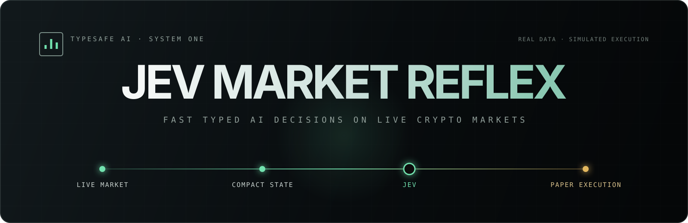
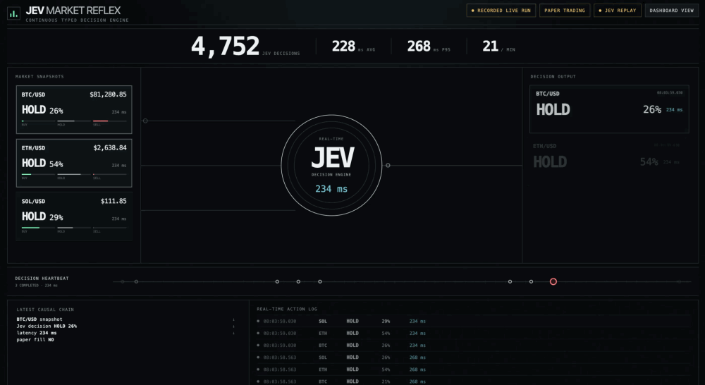

<p align="center">
  
</p>

<p align="center">
  <strong>Fast typed AI decisions on live crypto markets using TypeSafe AI Jev.</strong>
</p>

<p align="center">
  <a href="https://www.typescriptlang.org/"></a>
  <a href="https://bun.sh/"></a>
  <a href="LICENSE"></a>
  
</p>

<p align="center">
  Jev Market Reflex connects live BTC/USD, ETH/USD, and SOL/USD market data to Jev,<br>
  turns compact market state into typed <code>BUY</code> / <code>SELL</code> / <code>HOLD</code> decisions,<br>
  and applies them to a simulated paper portfolio.
</p>

<p align="center"><strong>Real market data. Simulated execution. No real money.</strong></p>

<p align="center">
  <a href="assets/demo.mp4"></a>
</p>

<p align="center"><a href="assets/demo.mp4"><strong>Watch the full-quality 16-second demo ↗</strong></a></p>

> **Live market data → compact state → Jev → typed decision → deterministic paper execution.**

## Quick start

Run the recorded demo with no API key and no external services:

```bash
git clone https://github.com/zzsong1023/jev-market-reflex.git
cd jev-market-reflex
bun install
bun run replay
```

Open [http://localhost:3000/?mode=theater](http://localhost:3000/?mode=theater). The standard dashboard remains available at [http://localhost:3000](http://localhost:3000).

The replay uses a sanitized real capture and is visibly labeled **RECORDED LIVE RUN · PAPER TRADING**.

## Live Jev mode

```bash
cp .env.example .env
# Add your TYPESAFE_API_KEY to .env
bun run dev
```

Open [http://localhost:3000/?mode=theater](http://localhost:3000/?mode=theater). Kraken's public market feed needs no exchange account or trading credentials.

The TypeSafe API key stays in the Bun server process. It is never sent to browser code, written to recordings, or printed in logs.

## What the loop does

```text
Kraken public WebSocket
        ↓
Bounded market features
        ↓
TypeSafe AI Jev
BUY / SELL / HOLD + probabilities
        ↓
Risk gate + deterministic paper execution
        ↓
Live browser visualization over SSE
```

A single Bun process maintains shallow order books and recent trade flow, computes short-horizon features, sends three Choice questions in one Jev System One request, applies deterministic risk rules, and streams the result to the browser. All state stays in memory.

Jev returns typed choices, confidence, and probabilities. Ordinary code owns every execution and risk rule.

## Example local run

Measured on September 19, 2026 using `jev-latest` and the live Kraken feed:

| Jev calls | Typed decisions | Failures | Missed cycles | Mean latency | P95 latency |
| ---: | ---: | ---: | ---: | ---: | ---: |
| 21 | 63 | 0 | 0 | 199 ms | 332 ms |

This is one observed local run, not a benchmark or latency guarantee. Results depend on network conditions, API conditions, and machine location.

## Paper execution and safety

- Confidence below `0.55` becomes `HOLD`.
- Position sizing is deterministic: `$100`, `$250`, or `$500` by confidence band.
- Absolute exposure is capped per symbol by `MAX_POSITION_USD`.
- BUY fills use the ask plus configured slippage; SELL fills use the bid minus slippage.
- Fees, long and short positions, realized P&L, unrealized P&L, and equity are simulated locally.
- Stale or disconnected market data pauses decisions and execution.
- There is no wallet, exchange credential, trading API, database, or authentication layer.

Displayed P&L is a simulation diagnostic, not evidence that Jev predicts markets successfully.

## Replay, recording, and video mode

`bun run replay` plays [`recordings/example.jsonl`](recordings/example.jsonl), a sanitized real Jev/Kraken capture containing HOLD, BUY, SELL, and paper-fill events. It preserves the recorded event timing and uses no network services.

```bash
# Optional playback speed
REPLAY_SPEED=1.5 bun run replay

# Capture a new bounded real session (20 seconds by default)
bun run record

# Optimize either view for a 1440×900 recording
VIDEO_MODE=true bun run replay
```

New captures are written under `recordings/` and ignored by Git. They contain market features, typed decisions, probabilities, measured latency, fills, and timestamps—never keys or request headers.

## Configuration

| Variable | Default | Purpose |
| --- | ---: | --- |
| `TYPESAFE_API_KEY` | — | Required only for live Jev mode |
| `JEV_MODEL` | `jev-latest` | TypeSafe model name |
| `DECISION_INTERVAL_MS` | `500` | Target decision-cycle interval |
| `STARTING_CASH` | `10000` | Virtual starting cash |
| `MAX_POSITION_USD` | `2000` | Maximum absolute exposure per symbol |
| `PAPER_FEE_BPS` | `5` | Simulated execution fee |
| `PAPER_SLIPPAGE_BPS` | `1` | Simulated fill slippage |
| `VIDEO_MODE` | `false` | Recording-optimized layout |
| `REPLAY_SPEED` | `1` | Replay speed multiplier |

## Testing

```bash
bun test
bun run typecheck
```

The focused tests cover feature computation, strict Jev response parsing, confidence gating, fills, P&L accounting, exposure limits, and the committed replay.

## Project structure

```text
public/              Dashboard and theater-mode presentation
src/
  market.ts          Kraken public WebSocket and bounded books
  features.ts        Compact short-horizon market features
  jev.ts             System One adapter and strict response parsing
  paper.ts           Deterministic paper execution and accounting
  server.ts          Live/record mode, metrics, and SSE
  recording.ts       Inspectable JSONL recording format
  replay.ts          Zero-network replay server
tests/               Focused Bun tests
recordings/          Committed sanitized demo capture
assets/              Demo video and README preview
docs/                Architecture notes
```

See [the architecture notes](docs/architecture.md) for system boundaries and [CONTRIBUTING.md](CONTRIBUTING.md) for the contribution workflow.

## Disclaimer

**This is an AI systems demo, not a production trading system or a claim of profitable trading. Real market data. Simulated execution. Not financial advice.**

## License

[MIT](LICENSE)
